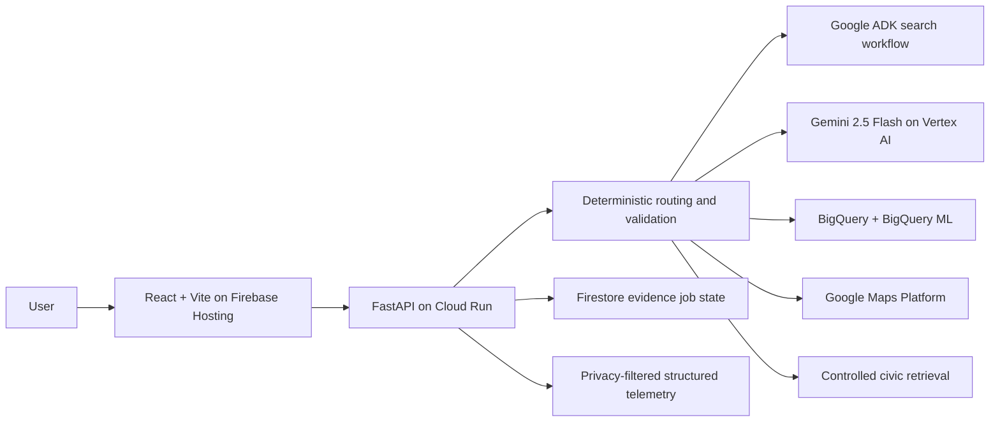

# NestIQ — Product and System Design Specification

| Field | Value |
|---|---|
| Product | NestIQ — AI-powered neighborhood decision intelligence |
| Team | WebHackers |
| Team members | Srishti Rathi — Team Leader; Amaan Khan |
| Hackathon | Google Cloud Gen AI Academy APAC, Cohort 2 |
| Problem statement | AI for Better Living and Smarter Communities |
| Product status | Implemented, verified, and deployed |
| Primary market | India-first, 13 cities and 73 catalog localities |
| Updated | 22 July 2026 |

## 1. Product definition

NestIQ helps a renter answer one high-stakes question: **where should I live?** It turns a
plain-language need into a personalized, evidence-labelled shortlist of localities. The
experience combines affordability, safety, commute, essential services, lifestyle, and
air-quality evidence without allowing a language model to silently invent or modify the
score.

The product supports two connected decisions:

1. **Move:** discover and compare localities in an unfamiliar city.
2. **Renew or move:** compare a current area with alternatives when a lease decision is due.

After discovery, Saved Localities, Alerts, City Pulse, Locality Pulse, rent verification,
and Copilot turn NestIQ into an ongoing neighborhood-awareness tool rather than a one-time
ranking page.

## 2. Intended users and outcomes

### Primary user

A renter or household moving within or between Indian cities, often under time, budget,
health, or commute pressure.

### Human stakes

For a parent whose child has asthma, or an older adult already struggling with respiratory
health, choosing a home is not only a rent-and-commute decision. A locality that appears
convenient can still mean repeated exposure to unhealthy air, while a cleaner option may be
unaffordable or too far from care. NestIQ makes those trade-offs visible together, with
absolute CPCB health bands and nearby-service evidence, so a family can ask better questions
before committing to a home. It supports an informed housing decision; it does not provide
medical diagnosis or treatment advice.

### Important scenarios

- A professional balancing monthly rent against travel time to a work hub.
- A parent seeking a lower-pollution locality for a child with asthma while staying near
  schools and hospitals.
- An older adult with respiratory vulnerability balancing cleaner air, nearby care, rent,
  and family access.
- A renter deciding whether a cheaper locality creates an unacceptable commute trade-off.
- A resident monitoring saved localities for verified civic or environmental updates.
- A user who wants a data answer such as “Which locality has the lowest AQI?” without
  learning SQL.

### Product outcome

NestIQ replaces fragmented research across maps, market pages, civic notices, and community
sources with one reviewable decision trail: a ranked result, visible pillar evidence,
explicit uncertainty, and links to the sources used.

## 3. Design principles

1. **Decision intelligence, not a generic dashboard.** Every view helps a user choose,
   compare, verify, or monitor a locality.
2. **Deterministic scoring.** Gemini may parse preferences and explain evidence; it cannot
   set arbitrary scores or override source validation.
3. **Evidence before confidence.** Live, grounded, curated, provisional, unavailable, and
   refreshing states remain visibly distinct.
4. **Health is absolute.** Air quality uses CPCB health bands and cannot look “clean” only
   because every option in a city is polluted.
5. **Missing stays missing.** An unavailable pillar is excluded and disclosed, never replaced
   with zero or a typical value.
6. **AI tools are selective.** A question invokes only the tools needed to answer it, and the
   response discloses which tools contributed.
7. **Slow evidence does not block browsing.** Independent sources load progressively, reuse
   verified cache entries, and reach bounded failure states.
8. **Temporary evidence never changes FitScore.** Civic events, community sentiment, and
   verification panels remain evidence beside the score.

## 4. Information architecture

| Surface | Purpose |
|---|---|
| Home | Capture natural-language priorities, budget, city, or the Family Health preset |
| Search & Results | Stream the ADK workflow and show ranked locality cards and map context |
| Locality detail | Explain FitScore across Overview, Affordability, Safety, Commute, Essentials & Lifestyle, Air Quality, and Community Insights |
| Compare | Place saved localities side by side and emphasize meaningful differences |
| Saved | Maintain a browser-local shortlist of locality snapshots |
| Alerts | Aggregate verified saved-locality alerts and a separate city-wide Pulse |
| Ask NestIQ | Provide multimodal general guidance, structured evidence, and BigQuery analytics |
| Sign in / Guest | Offer optional Google identity UI while keeping the public decision tools usable in guest mode |

Desktop and mobile navigation expose the same core routes. Major routes are lazy-loaded and
protected by loading, chunk-recovery, not-found, and retry states.

## 5. FitScore specification

### Formula

```text
FitScore = Σ(pillar sub-score × user weight) / Σ(available pillar weights)
```

| Pillar | Signal | Primary source | Default weight |
|---|---|---|---:|
| Air quality | Live AQI mapped to absolute CPCB health bands | Google Air Quality API | 25 |
| Affordability | Locality median rent relative to the user budget | Grounded market evidence or labelled curated baseline | 20 |
| Safety | Curated locality proxy or emergency-access resilience | Curated evidence or Google Places | 20 |
| Commute | Drive time with traffic to the city work hub | Google Distance Matrix | 20 |
| Essentials & lifestyle | Nearby amenities within the locality radius | Google Places (New) | 15 |

Gemini converts the user's words into bounded preference weights through a Pydantic schema.
The final arithmetic, missing-pillar renormalization, band assignment, tie handling, and
match label are deterministic Python operations.

### Air-quality rule

| CPCB band | AQI | Permitted air sub-score range |
|---|---:|---:|
| Good | 0–50 | 90–100 |
| Satisfactory | 51–100 | 75–89 |
| Moderate | 101–200 | 55–74 |
| Poor | 201–300 | 35–54 |
| Very Poor | 301–400 | 15–34 |
| Severe | 401+ | 0–14 |

Relative AQI rank is displayed separately and never lifts a locality out of its absolute
health band. Poor, Very Poor, and Severe readings create visible health-risk qualifiers.

### Evidence envelope

Every scored metric carries a structured envelope with:

`metric`, `value`, `unit`, `source`, `sourceType`, `status`, `fetchedAt`,
`geographicScope`, `confidence`, and `limitation`.

The UI renders these fields beside the metric. A provisional FitScore reports its coverage
and missing pillars, while a missing metric remains `null` rather than becoming a fabricated
number.

## 6. Core intelligent systems

### 6.1 Search and ADK orchestration

The Results flow can run an authentic Google Agent Development Kit workflow:

1. **NestIQ Planner** coordinates the fixed evidence-and-validation trajectory.
2. **Live Signals Agent** invokes the real locality ranking path.
3. **Analytics Agent** summarizes result counts, anomalies, and provisional coverage.
4. **Civic Intelligence Agent** retrieves controlled official evidence for the top result.
5. **Validator Agent** checks contradictions and incomplete evidence.
6. **Explainer** emits the final validated result.

The browser receives these events over Server-Sent Events. If ADK orchestration fails, the
same deterministic search capability remains available through a bounded fallback path.

### 6.2 NestIQ Copilot

Copilot uses a deterministic router before invoking any model or data tool:

| Question type | Route | Result |
|---|---|---|
| Greeting, calculation, or stable concept | General guidance | Normal Gemini answer, no claim of live evidence |
| Current city question | City evidence | Structured NestIQ evidence plus Gemini explanation |
| One verified selected-city locality name | Locality evidence | That locality's structured evidence and navigation action |
| Ranking, aggregate, or verified locality comparison | City analytics | Guarded BigQuery SQL, result rows, and Gemini explanation |
| Image question | Image evidence | Bounded in-memory Gemini image analysis |

Locality names are resolved against the selected city's catalog. BigQuery can read only
catalog-backed snapshot rows, so an unknown name cannot create or expose a non-catalog
locality. Analytics SQL is read-only, table-allowlisted, row-limited, dry-run cost checked,
maximum-bytes capped, and scoped to the selected city in the CTE with a bound parameter.
The response exposes the SQL and result board only when BigQuery actually contributes.

When AQI is present, deterministic code adds the CPCB band to the explanation context.
SQL generation and evidence summarization use short, low-temperature, no-thinking model
configurations; the general path retains normal Gemini behavior.

### 6.3 Community and civic evidence

- **Community Reviews** summarize grounded resident sentiment with source links.
- **Locality Pulse** checks recent, locality-scoped civic evidence.
- **City Pulse** runs the same validated pipeline with an explicitly city-wide scope.
- **Official Civic Knowledge** retrieves from a controlled official-document catalog and
  returns citation-locked, extractive answers.

Pulse items require validated citations. With grounding-support validation enabled, each
ledger line is tied to the exact grounding chunk linked to its response span. Unsupported
items are rejected. An explicit no-update signal is distinct from an unavailable source.

### 6.4 Rent verification

Affordability begins with a clearly labelled locality-level baseline. A user can request a
grounded current check that returns cited observations, median, range, sample size, source
count, home-size context, and confidence. Deterministic code validates observations and
calculates the range; the model does not write a price into FitScore.

The grounded job may be prepared after a locality click, but its green verification panel
remains hidden until the user selects **Verify current rent**.

### 6.5 Family Health and Resilience

This optional server-resolved profile prioritizes:

```text
Air quality 35 · Safety 28 · Commute 20 · Affordability 12 · Essentials 5
```

The client sends only the preset identifier. The server resolves an allowlisted profile and
rejects an unknown preset. Essential-service proximity is shown as context and remains
separate from the ordinary lifestyle score unless an explicit server feature flag enables it.

### 6.6 Saved localities and alerts

Saved locality snapshots remain in browser storage and can be added or removed at any time.
Alert checks use a bounded worker pool: four locality checks may progress concurrently, but
the watchlist itself is not capped at four. Results appear independently as each locality
finishes. City evidence is never substituted for failed locality evidence.

## 7. Data and model architecture

| Data or capability | System of record / provider | Use |
|---|---|---|
| City and locality catalog | Versioned application data | Verified IDs, names, centroids, labelled baselines |
| Live AQI and forecast | Google Air Quality API | Air pillar, history, 24-hour forecast |
| Amenities and essentials | Google Places (New) | Lifestyle and contextual proximity |
| Commute | Google Distance Matrix | Drive-time pillar |
| Current locality snapshots | BigQuery `india_localities` | Analytics and accumulated evidence history |
| Latest snapshot view | Runtime BigQuery CTE `india_localities_latest` | Guarded Copilot comparisons |
| AQI history | BigQuery `india_aqi_history` | Time-series accumulation |
| AQI forecast model | BigQuery ML `ARIMA_PLUS` | Model forecast with confidence bounds |
| Grounded generation | Gemini 2.5 Flash on Vertex AI with Google Search | Pulse, reviews, and market evidence |
| Durable evidence coordination | Cloud Firestore | Pulse and rent generation leases/results |
| Official civic corpus | Controlled application catalog | Citation-locked civic retrieval |

The platform does not scrape individual rental listings into a property marketplace and does
not present locality estimates as quoted offers.

## 8. System architecture



### Search request flow

```text
Natural-language need
  → schema-bound preference extraction
  → live city signals and deterministic scoring
  → ADK specialists and validator
  → ranked results + evidence envelopes + explanation
```

### Grounded evidence flow

```text
Locality/city request
  → Firestore generation lease
  → one bounded grounded search
  → deterministic citation and schema validation
  → durable terminal result
  → stale-while-revalidate reuse on later visits
```

## 9. API design

| Method | Route | Responsibility |
|---|---|---|
| GET | `/api/config` | Public browser configuration only |
| GET | `/api/cities` | Supported city catalog |
| GET | `/api/search/stream` | SSE ADK search trajectory and final ranking |
| GET | `/api/neighborhoods` | Ranked city snapshot |
| GET | `/api/neighborhood/{id}` | Full locality detail |
| GET | `/api/neighborhood/{id}/air-quality-forecast` | Fast Google-only AQI forecast |
| GET | `/api/neighborhood/{id}/reviews` | Grounded community review evidence |
| GET | `/api/neighborhood/{id}/pulse` | Locality-scoped civic Pulse |
| GET | `/api/city/{city}/pulse` | City-scoped Pulse |
| GET | `/api/neighborhood/{id}/rent-verification` | Grounded rent evidence job/status |
| GET | `/api/neighborhood/{id}/civic-knowledge` | Controlled official civic retrieval |
| POST | `/api/ask` | Selectively routed Copilot |
| POST | `/api/copilot/transcribe` | Bounded speech-to-text input |
| POST | `/api/copilot/analyze-image` | Bounded in-memory image analysis |

## 10. Security and privacy design

The public security posture is defined in [`SECURITY.md`](SECURITY.md). Core controls include:

- separate browser and server configuration paths;
- fail-closed CORS configuration for production origins;
- read-only, allowlisted, city-scoped, and cost-capped analytics SQL;
- schema validation and deterministic evidence validation around model output;
- bounded request sizes, timeouts, retries, and per-instance abuse controls;
- no model authority over FitScore arithmetic;
- structured telemetry that excludes prompts, answers, SQL, authorization data, secrets,
  document content, and provider error bodies;
- memory-only processing for uploaded audio and images;
- browser-local profile, saved-locality, and recent-question state with user-facing clear or
  remove controls.

The optional Google profile is presentation state only. It grants no backend authorization,
and public API responses do not contain user-specific server data.

## 11. Performance and resilience

- Route-level code splitting keeps the initial application bundle bounded.
- City snapshots use stale-while-revalidate caching.
- Concurrent cold requests for the same resource share one in-flight operation.
- Maps signal fan-out runs concurrently rather than serially.
- Locality click begins the independent detail, AQI, Pulse, and hidden rent-preparation paths.
- The AQI chart uses a dedicated route that skips city ranking and Gemini.
- Pulse and rent use Firestore-backed, generation-safe single-flight coordination.
- Community, Pulse, rent, AQI, and Copilot paths have finite loading and retry states.
- Identical Copilot questions reuse a short-lived response cache.
- Provider failures preserve previously validated evidence where available.

These optimizations change scheduling and reuse, not evidence acceptance rules.

## 12. Verification and acceptance gates

The implementation is accepted only when all of the following pass:

| Gate | Current verified result |
|---|---:|
| Backend test suite | 396 passing tests across 37 modules |
| Frontend test suite | 122 passing tests across 19 files |
| Combined automated checks | 521 passing tests |
| Responsible-agent scorecard | 18 / 18, zero billable calls |
| City publication validator | 0 structural errors across 13 cities |
| Production frontend build | Passing with Vite 8.1.5 |

The responsible-agent scorecard covers CPCB boundaries, missing-data honesty, unsupported
source rejection, SQL security, controlled RAG, Copilot tool routing, ADK trajectory,
contradiction control, and graceful degradation.

## 13. Demo sequence for judges

1. Launch **Family Health & Resilience** and show the changed server-confirmed priorities.
2. Open the top result and inspect its evidence envelope, CPCB band, and missing-data state.
3. Open **Community Insights** to show Locality Pulse and citation-locked civic knowledge.
4. Select **Verify current rent** and distinguish the baseline from grounded observations.
5. Ask Copilot “What does AQI 110 mean?” to show the normal Gemini path.
6. Ask “Which locality has the lowest AQI?” to show guarded BigQuery and the SQL board.
7. Ask a name-only comparison such as “Compare Adyar and Velachery” to demonstrate
   catalog-aware routing.
8. Save several localities and open Alerts to show independent locality results plus the
   separate City Pulse.

## 14. Product boundaries

- NestIQ compares localities, not individual flats, hostels, or quoted rental offers.
- Safety is a labelled proxy or resilience signal, not a prediction of individual crime risk.
- Community and civic evidence informs the user but never modifies FitScore.
- An unavailable provider produces an unavailable or refreshing state, not synthetic evidence.
- The public API is a shared catalog service; optional client identity does not create a
  privileged backend session.

These boundaries are part of the design contract and protect the product from overstating
what its evidence can support.
