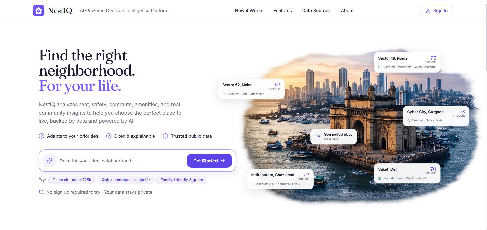

<div align="center">

#  &nbsp;NestIQ

### AI-Powered Decision Intelligence Platform

**Find the right neighborhood. For your life.**

Ask in plain language. Real Google ADK agents gather live evidence, a deterministic engine scores it, and a validator checks the result before you see it. Every number is sourced, or openly marked unavailable.


Built for the **Google Cloud Gen AI Academy APAC — Cohort 2 Hackathon**
Problem Statement: *AI for Better Living and Smarter Communities*

**[Live Demo → nestiq-india.web.app](https://nestiq-india.web.app)**

<br />



</div>

---

##  &nbsp;Overview

**The persona.** A young professional or student relocating to a new city for a job. They have three days to pick a neighborhood they have never seen. They need to balance rent, commute time to a new office, and safety — and in Indian metros, they *must* also weigh air quality. Today that means juggling a dozen browser tabs: rent portals, a maps app for commute, word-of-mouth for safety, and a separate app for AQI. The data exists, but it is scattered, unpersonalized, and never predictive.

**NestIQ turns all of that into a single decision.** You describe what you need in one sentence — *"clean air, safe area under ₹25,000, short commute"* — and NestIQ returns a ranked shortlist of localities, each with a transparent **FitScore**, a live air-quality forecast, cited resident sentiment, and a plain-language explanation of *why* it fits **you**.

It is not a search filter with sliders. It is a **parallel multi-agent system** that converts natural language into weighted priorities, pulls live data from Google Maps Platform, forecasts air quality with a model it trains itself in BigQuery ML, and streams the specialist scoring process to the browser over Server-Sent Events so you can watch the system think.

> **Design principle: zero hallucination.** Every number NestIQ shows is traceable to a live source. FitScores come strictly from Google Maps and Air Quality APIs. Natural-language questions are turned into real BigQuery SQL and the exact query is shown to you alongside the answer. Gemini explains the numbers; it never invents them.

---

##  &nbsp;What makes it different

| Capability | What is behind it |
|---|---|
| **Zero hallucination, everything sourced** | FitScores are derived strictly from live Google Maps and Air Quality APIs. NL questions become real BigQuery SQL, and the generated query is shown to the user next to the cited answer. |
| **Conversational analytics (NL → SQL)** | Ask a cross-locality question ("Where is rent under ₹25k and AQI under 150?") and Gemini writes a real **BigQuery SQL** query, runs it against the locality warehouse, and answers grounded in the returned rows — with the SQL shown to you. |
| **Self-building dataset + our own ML forecast** | Every search snapshots live features into BigQuery (`india_localities`) and appends hourly AQI (`india_aqi_history`). A **BigQuery ML ARIMA_PLUS** model trained on that accumulating history produces our own AQI forecast, with confidence intervals, alongside Google's. |
| **Anomaly detection** | NestIQ automatically flags localities that break the city pattern — a cross-sectional outlier (a metric ≥ 1.5σ from the city mean, e.g. *"unusually polluted"*, *"unusually affordable"*) and a temporal AQI spike versus a locality's own 24-hour history. Directly answers the PS requirement to "identify patterns, trends, and anomalies." |
| **Explainable FitScore, never a black box** | A 0–100 match across five pillars, weighted by *your own words*. A published methodology panel shows every pillar's weight, why it carries that weight, and its live data source. Weights re-tune live with sliders. |
| **Real Google ADK agents, not narration** | A **Google ADK** Planner coordinates Live Signals, Analytics and Civic Intelligence specialists, then a Validator checks the scored output for contradictions before an Explainer summarises it. Every agent performs actual work and reports what it really did — streamed over **SSE**. A legacy path takes over automatically if ADK ever fails, so search never breaks. |
| **Air quality that cannot flatter itself** | Air is scored on **absolute CPCB health bands**, never relative ranking. AQI 500 can never score 96 because it happens to be the least-polluted option. If every locality is Severe, they all read Severe, and the "least polluted" claim is only made when raw values actually differ. |
| **Honest missing data** | A failed live call is never dressed up as a reading. Signals return an explicit unavailable state, the FitScore is labelled **provisional** with its coverage percentage, and the affected pillar is excluded rather than guessed. |
| **Air quality as a first-class pillar** | Live **CPCB AQI** per locality via the Google Air Quality API — current reading, 24-hour history, and 24-hour forecast — weighted into every recommendation. Built for the reality of Indian cities. |
| **Cited resident sentiment** | Grounded retrieval: Gemini + Google Search surfaces what residents say online, summarized with clickable source citations, cached for 24 hours. |
| **9 cities, Tier-1 to Tier-3** | Delhi NCR, Mumbai, Bengaluru, Kolkata, Hyderabad, Chennai, Pune, **Patna**, and **Ranchi** — decision intelligence is not just for the metros. |

---

##  &nbsp;How it works

```text
                        "clean air, safe, under ₹25,000"
                                        │
                                        ▼
                           ┌─────────────────────────┐
                           │      Planner Agent      │   Gemini extracts a budget and a
                           │    natural language →   │   weight per pillar from your words
                           │     weights + budget    │
                           └────────────┬────────────┘
                                        │
                                        ▼
                           ┌─────────────────────────┐
                           │   Data Collector Agent  │   Live fan-out to Google Maps
                           │   live Google signals   │   Platform · 30-min SWR cache
                           └────────────┬────────────┘
                                        │
                                        ▼
   ┌──────────────┬──────────────┬──────────────┬──────────────┬──────────────┐
   │ Air Quality  │ Commute      │ Safety       │ Lifestyle    │ Affordability│
   │ Agent        │ Agent        │ Agent        │ Agent        │ Agent        │
   │ • CPCB AQI   │ • Traffic    │ • Locality   │ • Places     │ • Rent vs    │
   │ • 24h trend  │   Matrix     │   profile    │   ≤ 1.5 km   │   budget     │
   │ • BQML fcast │ • Drive to   │ • Env.       │ • Amenity    │ • Min-max    │
   │              │   work hub   │   health     │   density    │   normalized │
   └──────────────┴──────────────┴──────────────┴──────────────┴──────────────┘
                                        │
                                        ▼
                           ┌─────────────────────────┐
                           │       Orchestrator      │   Combines pillar sub-scores
                           │    weighted FitScore    │   with your extracted weights
                           └────────────┬────────────┘
                                        │
                                        ▼
                Ranked FitScores + anomaly flags, streamed to the
                 UI over SSE, then explained by Gemini on the detail page
```

**The flow.** Your sentence goes to Gemini, which extracts a budget and a weight for each pillar. Live AQI, amenity, and commute data is fetched per locality (cached 30 minutes). Each pillar agent normalizes its metric across the city, the orchestrator combines them with your weights into FitScores, and results stream back with anomaly flags and explanations. Every search also snapshots the features into BigQuery, so the warehouse — and the ARIMA_PLUS forecast trained on it — grows with use.

---

##  &nbsp;The FitScore

```text
FitScore = Σ (pillar_subscore × your_weight) / Σ weights
```

| Pillar | Signal | Source | Default weight |
|---|---|---|---|
| **Air Quality** | Live CPCB AQI (lower is cleaner) | Google Air Quality API | 25% |
| **Affordability** | Median monthly rent vs. your budget | Curated market estimate (labeled in-app) | 20% |
| **Safety** | Locality safety index blended with live environmental health | Curated baseline (labeled — open locality-level crime data does not exist for India) | 20% |
| **Commute** | Live drive time with traffic to the city's work hub | Google Distance Matrix | 20% |
| **Essentials & Lifestyle** | Amenities within 1.5 km (restaurants, cafes, gyms, parks, markets) | Google Places (New) | 15% |

Sub-scores are **min-max normalized within the selected city**, so a 90 in Patna means "best in Patna," not "as clean as Zurich." Air Quality carries the highest default weight because, across Indian cities, it is the most health-critical signal and the one that varies most between localities. **The weights are yours** — parsed from your query by Gemini and adjustable live with sliders. The detail page publishes the full rubric so the score is explainable, never a black box.

---

##  &nbsp;Trust model — how a number earns its place

The hardest problem in a scoring product is not computing a score. It is refusing to show one you cannot defend.

**Air quality is absolute, never graded on a curve.** Sub-scores for rent, commute and amenities are min-max normalized within a city, which is fine for preferences. Applying that to air would be dangerous: it would let the least-polluted locality in a Severe city score near-perfect. Air is therefore scored on **absolute CPCB health bands**, and relative rank is reported separately.

| CPCB band | AQI | Air sub-score |
|---|---|---|
| Good | 0-50 | 90-100 |
| Satisfactory | 51-100 | 75-89 |
| Moderate | 101-200 | 55-74 |
| Poor | 201-300 | 35-54 |
| Very Poor | 301-400 | 15-34 |
| Severe | 401+ | 0-14 |

A locality can rank better than its neighbours **within** a band, but never escape it. AQI 500 cannot score 96. If every locality reads Severe, every locality shows Severe, and "least polluted" is only claimed when the raw values genuinely differ.

**Every metric carries its provenance.** Each pillar ships an evidence envelope (value, source, source type, fetch time, geographic scope, confidence, limitation) rendered in the UI beside the number:

| Label | Meaning |
|---|---|
| Live Google signal | Fetched now from a Google API |
| Government historical evidence | Official published record |
| Market estimate | Indicative, not a quoted offer |
| Curated locality proxy | A stand-in where no open dataset exists (rent, safety) |
| Temporarily unavailable | The call failed, and we say so |

**Missing data is stated, not invented.** A failed call returns an explicit unavailable state, keeping the original timestamp if a stale reading exists. The pillar is excluded from the FitScore, the score is labelled **provisional** with its coverage percentage, and nothing is back-filled with a plausible-looking default.

---

##  &nbsp;Google ADK agent system

The agent layer is real orchestration, not a progress animation. It is built on the **Google Agent Development Kit**, coordinated by a Planner and streamed to the browser over SSE.

```text
                    NestIQ Planner  (ADK coordinator)
                    parses the request, selects tools
                                 |
        +------------------------+------------------------+
        v                        v                        v
  Live Signals            Analytics                Civic Intelligence
  AQI - Places            snapshots -              citation-locked
  commute - photos        anomalies - BQML         civic retrieval
        +------------------------+------------------------+
                                 v
                    FitScore Engine  (deterministic)
                 arithmetic is never delegated to an LLM
                                 |
                                 v
                     Validator  ->  Explainer
             contradiction and        plain-language summary
             coverage checks          from validated evidence only
```

Two rules make this trustworthy rather than theatrical:

- **The model never does arithmetic.** Gemini extracts intent and explains results. Scoring is a deterministic Python engine, so identical inputs always produce an identical score.
- **Agents report what they actually did.** Messages are generated from real tool output ("Analyzed 8 locality snapshots; 4 anomalies", "Retrieved 3 scoped civic documents", "no scoped document matched; none invented"), never a scripted "done". If ADK fails for any reason a legacy path takes over automatically, so search never breaks.

---

##  &nbsp;Civic evidence (RAG)

Retrieval is used where it genuinely closes an evidence gap: **official civic documents** such as development plans, water-quality and pollution-control reports, transport plans and environmental notices.

It is deliberately **not** used for anything live. AQI, commute, amenities and current listings come from APIs, because a stale PDF must never answer a question about right now.

Every passage keeps its document title, issuing authority, publication date, geographic scope and **page number**, and links back to the original source. Retrieval is pre-filtered by city and locality, and prompt-injection attempts inside retrieved documents are detected. When nothing relevant exists, NestIQ says so, rather than generating evidence to avoid an empty state.

---

##  &nbsp;Locality Pulse and Alerts

One grounded pipeline powers three surfaces: Community Insights (locality), Alerts City Pulse (city-wide), and watchlist warnings for saved localities. There is no second event pipeline.

Each event carries a headline, grounded summary, category (environment, mobility, civic, safety, development), severity, geographic scope, publication time, publisher, and a link to the original source. Events are deduplicated, official sources are preferred, and the default window is 30 days.

**Temporary events never move a FitScore.** They are evidence shown beside the score, never folded into it. The empty states are also kept distinct: "no verified updates" is a different claim from "the source could not be reached", and the UI never shows the first when it means the second.

---

##  &nbsp;Family Health and Resilience

An optional preset for the household this product is really for: someone with an asthmatic child or an elderly parent, who cannot treat air quality as a nice-to-have.

> *"Find a neighbourhood under 25,000 for my asthmatic child and elderly mother, with cleaner air, a hospital and school nearby, and under 30 minutes to work."*

Selecting it applies a fixed, published weight profile (**Air 35 - Safety 28 - Commute 20 - Affordability 12 - Essentials 5**) resolved server-side from an allowlisted preset id. The browser can never inject its own weights, and the "Prioritized for family health" badge appears only when those weights were genuinely applied.

Alongside it, **Essential Services** proximity (hospitals, doctors, pharmacies, schools, universities) is surfaced per locality from Google Places, captioned *"shown for context, not part of the FitScore."* It is deliberately excluded from scoring until the weighting is validated, and that exclusion is enforced in code, not just in copy.

---

##  &nbsp;Security and cost control

| Control | Implementation |
|---|---|
| **CORS allowlist** | Origins come from configuration and fail **closed**: unset means loopback only, so a misconfigured deploy breaks loudly instead of silently serving the world |
| **Key separation** | The browser receives a referrer-restricted Maps key only; the server key used for Air Quality, Places and Distance Matrix is never returned by any endpoint |
| **NL to SQL allowlist** | Model SQL may read exactly one table. Backticked or qualified references, comma joins, UNIONs to other tables, comments and stacked statements are rejected before BigQuery is touched |
| **Query cost ceiling** | Every generated query is dry-run for a byte estimate, rejected above the cap, then executed with `maximum_bytes_billed`. Row limits alone were never cost control |
| **Request limiting** | Fixed-window limiter on the expensive Gemini and BigQuery path, returning 429 with `Retry-After` |
| **Bounded model calls** | The Vertex client is built with an explicit timeout so a hung generation cannot hold a request open |
| **Secret Manager ready** | Optional, flag-gated backing that fails safe to environment values and never logs secret material |

Scope is stated honestly: the limiter is **per instance**, so a genuinely global cap needs edge enforcement (Cloud Armor or API Gateway). `docs/SECURITY_RUNBOOK.md` carries the operator steps with a verification command for each.

---

##  &nbsp;Anomaly detection

NestIQ automatically surfaces localities that break the pattern — free of extra API calls, reusing metrics already fetched:

- **Cross-sectional outliers.** For each metric, a locality flagged when its value sits **≥ 1.5σ from the city mean** — for example *"Unusually polluted — AQI 251, 1.7σ above the city average"* or *"Unusually affordable — ₹17,000/mo, 1.5σ below."* Shown as an "Anomalies detected" panel on results and as flag chips on the detail page.
- **Temporal AQI spikes.** On the Air Quality tab, the current reading is compared to the locality's own 24-hour history; a genuine spike (≥ 1.5σ from its rolling mean) is flagged, so a pollution event is caught the moment it happens.

Guardrails keep it honest: a minimum-sample floor and a two-flags-per-locality cap prevent false positives on thin data.

---

##  &nbsp;Tech stack

| Layer | Technology |
|---|---|
| **AI / LLM** | **Gemini 2.5 Flash on Vertex AI** — structured output (Pydantic schemas), NL → weights, NL → SQL, grounded Q&A, explanations, Google-Search-grounded web reviews |
| **Data warehouse & ML** | **BigQuery** (locality snapshots + hourly AQI history) · **BigQuery ML ARIMA_PLUS** (AQI forecasting with confidence intervals) · **BigQuery public datasets** (NYC 311, NYPD collisions) for the reference pipeline |
| **Live data** | **Google Maps Platform** — Air Quality API (CPCB), Places API (New), Distance Matrix, Maps JavaScript SDK, Place Photos |
| **Backend** | **FastAPI** (Python) · Server-Sent Events streaming · self-healing Vertex client · read-only SQL guards |
| **Frontend** | **React 18 + Vite** · Tailwind CSS · Recharts · lucide-react · **Google Identity Services** (OAuth sign-in) + guest mode |
| **Auth & state** | Client-side **Google sign-in** (Google Identity Services, JWT decode) · localStorage watchlist, saved localities, and recent questions |
| **Deployment & CI** | **Cloud Run** (backend, containerized by **Cloud Build** and stored in **Artifact Registry**) · **Firebase Hosting** (frontend) |

> **Google Cloud footprint.** Vertex AI (Gemini 2.5 Flash) · Google Search grounding · BigQuery · BigQuery ML (ARIMA_PLUS) · BigQuery public datasets · Google Maps Platform (Air Quality, Places New, Distance Matrix, Maps JS SDK, Place Photos) · Google Identity Services (OAuth sign-in) · Cloud Run · Cloud Build · Artifact Registry · Firebase Hosting.

---

##  &nbsp;Data sources & honesty

Being explicit about provenance is a feature, not a footnote:

- **Live** — CPCB AQI (via Google), amenity counts, commute times, and locality photos are fetched in real time and cached for 30 minutes.
- **Estimated & labeled** — median rents and safety baselines are curated market estimates; open locality-level data for these does not exist in India, and the UI says so wherever they appear.
- **Accumulating** — BigQuery tables grow with every search, and the ARIMA_PLUS forecast model improves as history builds up.
- **Reference pipeline** — the repo also contains a complete NYC pipeline (Zillow ZORI + NYC 311 + NYPD collisions in BigQuery, rent forecasting with ARIMA_PLUS) that validated the architecture on fully open public data.

---

##  &nbsp;Resilience & production

Production-class safety nets so the platform stays up under demo conditions:

- **NL to SQL runs against an allowlist** — model-written SQL may read exactly one table. Qualified/backticked references, comma joins, UNIONs to other tables, comments and stacked statements are rejected *before* any BigQuery client is constructed. See [Security](#-security--cost-control).
- **Stale-while-revalidate caching** — locality base metrics cached 30 minutes; Gemini explanations, detail payloads, and web reviews cached up to 24 hours, so responses are instant and LLM cost stays low.
- **Parallel fan-out** — the five pillar agents and all Google calls run concurrently, keeping a full search to roughly 2–3 seconds cold and about 10 ms warm.
- **Concurrent-build de-duplication** — simultaneous requests for the same city share one live build instead of each hammering Google.
- **Graceful fallbacks** — if the Air Quality API is cold or rate-limited, the system falls back to BigQuery snapshots or clearly labeled samples rather than failing.
- **Non-blocking logging** — BigQuery snapshot writes happen off the request thread and only when data actually changed.
- **Evidence prefetched on intent** — hovering or tapping a locality card starts the slow grounded fetches (civic pulse, essential services, resident sentiment, rent evidence) before the click lands, so the detail page opens with data already in flight instead of from cold. Guarded per locality so repeated hovers never re-fire.
- **Interaction polish** — a branded cursor set (arrow, pointer, text, grab/grabbing) drawn in the product's own gradient, plus a soft trailing halo. The native cursor stays pixel-accurate so clicking never feels laggy; the halo is decorative, `pointer-events: none`, and disables itself under `prefers-reduced-motion`.

---

##  &nbsp;Project structure

```text
NestIQ/
├── src/                         React frontend (Vite)
│   ├── pages/                   Home · Results · NeighborhoodDetail (7 tabs) · Compare · Saved · Alerts · Ask · SignIn
│   ├── components/              result cards · agent progress (SSE) · pulse events · filters · maps · gauges · layout
│   └── lib/                     API client · presets · essentials · fitscore · watchlist pulse · city store · auth · adapters
├── backend/
│   ├── app/
│   │   ├── main.py              FastAPI endpoints, CORS allowlist, search presets, rate limiting
│   │   ├── adk_orchestration.py Google ADK coordinator + specialist agents, Validator, Explainer
│   │   ├── gemini.py            NL → weights, NL → SQL, explanations, grounded reviews / pulse / rent
│   │   ├── maps.py              Air Quality · Places · Distance Matrix · India scoring · anomalies
│   │   ├── air_quality.py       Absolute CPCB bands, health scoring, critical-risk flags
│   │   ├── evidence.py          Provenance envelopes for every pillar
│   │   ├── civic_rag.py         Citation-locked civic document retrieval
│   │   ├── sql_guard.py         NL → SQL table allowlist and row cap
│   │   ├── rate_limit.py        Per-instance request limiting
│   │   ├── secrets.py           Optional Secret Manager backing (default off)
│   │   ├── bq_india.py          BigQuery snapshots, AQI history, ARIMA_PLUS, cost caps
│   │   ├── india.py             9 cities · 63 localities · default weights
│   │   └── fitscore.py          Normalization + weighted scoring engine
│   └── tests/                   253 backend tests across 25 modules (fully offline)
├── docs/SECURITY_RUNBOOK.md     Key rotation, referrer restriction, deploy verification
├── assets/readme/               themed section icons
└── README.md
```

---

##  &nbsp;Setup & local development

**Prerequisites:** Node 18+, Python 3.12+, and a GCP project with **BigQuery, Vertex AI, Air Quality, Places (New), and Distance Matrix** APIs enabled, plus `gcloud auth application-default login`.

**1. Backend (FastAPI)**

```bash
cd backend
python -m venv .venv && source .venv/bin/activate      # Windows: .venv\Scripts\activate
pip install -r requirements.txt
cp .env.example .env                                    # fill in the values below
python seed_bq_india.py delhi-ncr                       # optional: seed BigQuery from live data
python -m uvicorn app.main:app --port 8080
```

`backend/.env`:

```env
GCP_PROJECT=your-project-id
GCP_LOCATION=us-central1
BQ_DATASET=nestiq
GEMINI_MODEL=gemini-2.5-flash

# Server-only key: Air Quality, Places, Distance Matrix. Never sent to a browser.
MAPS_API_KEY=your-server-maps-key
# Public key served to the browser for the Maps JS SDK.
# Restrict this one by HTTP referrer in the Google Cloud console.
MAPS_BROWSER_KEY=your-browser-maps-key
# CORS allowlist. UNSET = localhost only, so a misconfigured deploy fails loudly.
ALLOWED_ORIGINS=http://localhost:5173
```

**2. Frontend (React + Vite)**

```bash
npm install
npm run dev                                             # http://localhost:5173
```

Optional: set `VITE_GOOGLE_CLIENT_ID` in a root `.env` to enable "Continue with Google" (guest mode works without it).

> **Security:** `.env` files are gitignored. Restrict your Maps key (HTTP referrers + only the APIs above) before any public deployment.

---

##  &nbsp;API reference

| Method | Endpoint | Description |
|---|---|---|
| `POST` | `/api/search` | NL query to weighted FitScore ranking. Optional `preset` (allowlisted server-side) applies a published weight profile |
| `GET` | `/api/search/stream` | Same, streamed as SSE ADK agent events (Planner, Live Signals, Analytics, Civic Intelligence, Validator, Explainer) |
| `GET` | `/api/neighborhoods` | All localities for a city, ranked on default weights |
| `GET` | `/api/neighborhood/{id}` | Full detail: sub-scores, evidence envelopes, anomalies, AQI history, Google forecast and BQML forecast |
| `GET` | `/api/neighborhood/{id}/essentials` | Essential-services proximity (hospitals, doctors, pharmacies, schools, universities). Context only, never scored |
| `GET` | `/api/neighborhood/{id}/reviews` | Cited resident sentiment (Gemini + Google Search grounding) |
| `GET` | `/api/neighborhood/{id}/pulse` | Grounded civic events for a locality |
| `GET` | `/api/neighborhood/{id}/rent-verification` | On-demand grounded rent evidence beside the curated estimate |
| `GET` | `/api/neighborhood/{id}/civic-knowledge` | Citation-locked civic document retrieval (title, authority, page) |
| `GET` | `/api/city/{city}/pulse` | City-wide civic pulse, same pipeline as locality pulse |
| `GET` | `/api/cities` | Supported cities |
| `GET` | `/api/config` | Browser-safe config only. Never returns the server Maps key |
| `GET` | `/api/health` | Liveness and configured cities |

Unknown `preset` or `lang` values are rejected with `422` rather than silently ignored, so a
client can never quietly get a different ranking than the one it asked for.

##  &nbsp;Testing & quality

**305 automated tests** (253 backend across 25 modules + 52 frontend) run fully offline. Every external
service is stubbed, so the suite is deterministic and CI-safe.

| Suite | Focus |
|---|---|
| `test_air_quality.py`, `test_air_provenance.py` | Absolute CPCB bands: equal AQI, all-Severe, category boundaries, missing readings, ranking monotonicity, and that a Severe reading can never score outside its band |
| `test_fitscore.py` | Normalization, weight-driven re-ranking, provisional scoring with coverage, anomaly flags, match labels |
| `test_evidence.py`, `test_safety_rent.py` | Provenance envelopes per pillar, curated-vs-live labelling, stale timestamps, grounded rent verification |
| `test_sql_guard.py` | NL to SQL allowlist: comma joins, qualified/backticked tables, UNION escapes, nested subqueries, comments, stacked statements, plus legitimate queries that must still pass |
| `test_analytics_query_guard.py` | Nothing invalid reaches BigQuery; dry run precedes execution; `maximum_bytes_billed` is set; city filter is parameterised |
| `test_security_config.py`, `test_rate_limit.py`, `test_secrets.py` | CORS fails closed, server key never leaves the server, per-instance limiting and 429s, Secret Manager fails safe and never logs secret material |
| `test_presets.py`, `test_essentials.py`, `test_essentials_flag.py` | Family-health preset weights and 422 on unknown ids; essential services stay separate from lifestyle scoring |
| `test_civic_rag.py`, `test_city_pulse.py`, `test_pulse_failure_state.py` | Citation-locked retrieval, shared pulse pipeline, and honest failure states instead of endless loading |
| `test_api.py`, `test_maps_cache.py`, `test_efficiency.py` | Full API contract, ADK stream contract with legacy fallback, stale-while-revalidate cache, parallel fan-out, concurrent-build de-dup |
| `src/lib/*.test.js` | Indian-notation formatting, FitScore re-weighting, city detection, presets, essentials, and watchlist aggregation honesty rules |

```bash
cd backend && python -m pytest -q     # 253 passed
npm test                              # 52 passed
npm run build                         # production build
```

##  &nbsp;Demo flow

1. **The persona.** A family relocating to Delhi NCR, with an asthmatic child and an elderly parent.
2. **The preset.** Use **Family Health & Resilience** on the home page. The published weight profile
   (Air 35, Safety 28, Commute 20, Affordability 12, Essentials 5) is applied server-side, and the
   results header confirms it was genuinely applied.
3. **The agents.** Watch the ADK Planner, Live Signals, Analytics, Civic Intelligence, Validator and
   Explainer stream real findings over SSE.
4. **The honesty proof.** Open the top match. The FitScore panel publishes every pillar weight and its
   source. Any missing signal is labelled unavailable and the score is marked provisional with its
   coverage percentage, rather than quietly guessed.
5. **Absolute air.** Open Air Quality. The CPCB band is absolute, so a polluted locality cannot look
   healthy merely by being the best of a bad set. The BigQuery ML ARIMA_PLUS forecast runs beside
   Google's own forecast.
6. **Essential services.** On Essentials & Lifestyle, hospitals, doctors, pharmacies, schools and
   universities are shown for context and explicitly excluded from the score.
7. **Civic evidence.** Community Insights carries grounded resident sentiment, current Locality Pulse
   events, and official civic documents with authority, date and page number.
8. **Conversational analytics.** In Ask NestIQ, ask a cross-locality question and watch Gemini write
   real BigQuery SQL, guarded by a table allowlist and a dry-run cost check, with the query shown.

##  &nbsp;Roadmap

- Rotate to a referrer-restricted browser Maps key and move secrets into Secret Manager
  (code support is already in place, see `docs/SECURITY_RUNBOOK.md`)
- Global rate limiting at the edge (Cloud Armor or API Gateway) rather than per instance
- Real rent ingestion (city rent indices) into BigQuery to replace the curated estimate
- Scheduled watchlist alerts on AQI threshold crossings via Cloud Scheduler
- Route-level code splitting to bring the initial bundle under the 500 KB budget
- Hindi and regional-language interface
- Validated onboarding workflow for additional cities

---

<div align="center">

Built for better living and smarter communities · Powered by Google Cloud & Gemini

</div>
